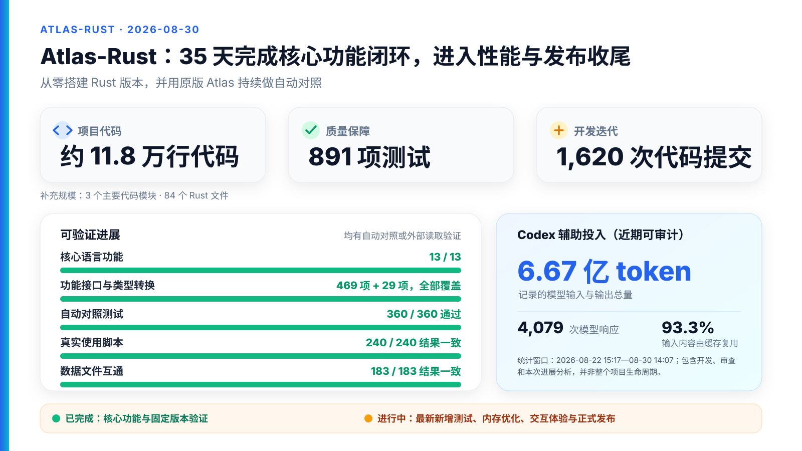
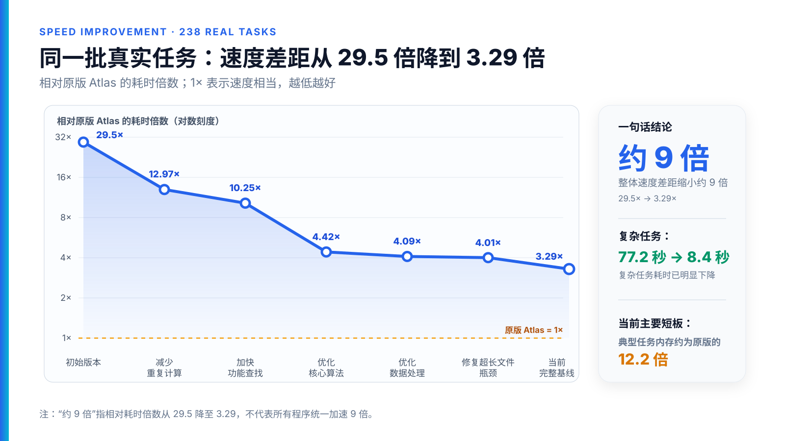

# Atlas-Rust 项目进展审计与汇报素材

> 综合数据截止：2026-08-30 14:18 CST；AI telemetry 冻结于 14:07:51 CST（最终 HPC 队列快照：`3651598`、`3651600`、`3652389` 均仍为 PENDING）
> 审计对象：本地开发分支 `codex/continue-atlas-port`，已提交 HEAD `b94f124090d8e4d5384034521504d869831de50e`
> 核心结论：**Atlas 语言与主要数学域的功能移植已经基本闭合；项目已经从“补功能”转入“收紧验证、迁移紧凑 Weyl 表示、降低性能/内存差距、完成发布工程”的阶段。**

## 0. 口径说明：这份报告怎样避免“完成度”误读

本报告把四种状态严格分开：

1. **实现存在**：源码中有对应路径，不等于兼容性已经被证明。
2. **历史固定提交已验证**：有 clean commit、HPC job 和可校验报告，是当前最强证据。
3. **当前 HEAD 已验证**：必须是当前精确源码树的门禁；不能用较早的 360/360 自动外推。
4. **发布完成**：还要求 tag、CI、安装/发布产物、许可证正文、用户文档与远端同步；这与语言功能完成是两回事。

审计开始时，工作树另有 16 个用户未提交修改（15 个 Rust 文件），不计入已完成成果，也不作为任何验证结论的基线。本报告与两张 SVG 图表是本次任务新增资产；静态规模统计会明确标注是 HEAD 还是当前工作树口径。

证据优先级如下：

| 等级 | 证据 | 本报告中的用法 |
|---|---|---|
| A | 精确 commit + clean source state + XMU SLURM/HPC 报告 + report SHA | 支撑“已通过/已兼容” |
| B | 冻结的 Atlas oracle events/meta、源代码静态审计、Git 历史 | 支撑覆盖面、实现结构与工程事实 |
| C | `HANDOFF.md`、`REMAINING_BUILTINS.md` 等按时间追加的工程账本 | 用于解释演进；必须与较新报告交叉核对 |
| D | README 中的概括性状态 | 仅用于发现文档漂移，不作为当前能力依据 |

## 1. 一分钟结论

### 1.1 可以对外讲的结论

- **语言能力矩阵已闭合**：[`LANGUAGE.md`](LANGUAGE.md) 的 13/13 个语言表面均为 `supported`；其定义要求 reference corpus、Rust 实现和 HPC 差分，不是“能编译就算完成”。
- **上游 builtin 注册表已闭合**：469/469 个 upstream `(name,args)` builtin 对与 29/29 个 coercion 已映射；静态审计没有发现合法 Atlas 输入可触发的 loud NYI。
- **有成熟的全量兼容性基线**：HPC job `3650652` 在 clean commit `503f81f` 上实现 360/360 PASS、0 pending、`compatibility_claim=true`。该提交的源码 tree 与活跃分支检查点 `28ec875` 完全相同。
- **真实脚本而非只有微型 fixture 也已闭合**：上游 `atlas-scripts` 语料达到 240/240 MATCH、0 skip；其中两个约 3 MB 的 E8 单行脚本在 fat 分区单独闭合。
- **KL 文件互操作已验证**：Rust 写出的 A1/A2/B2/G2 block/matrix/KL-store 被上游 `KLread` 回读，183/183 个 polynomial pair 一致。
- **项目当前不是在补一批缺失 builtin**：主要工作已经转为紧凑 `WeylElt`/`InvolutionId` 迁移、内存优化和边缘语义硬化。
- **近期 AI 投入可以量化，但不是全项目账单**：2026-08-22 15:17 至 8 月 30 日 14:07 的本地可见记录，经父子任务快照去重后有 4,079 次计量模型响应、6.666 亿 token；已分类 input 中 93.32% 是 cached input。按当前 GPT-5.6 Sol API 公价折算约 **$570–575**，而不是实际账单；无缓存反事实约 **$3.572k–3.575k**。
- **35 天不是 35×24 人时**：Git 会话化估计给出 **205.3–237.5 小时系统开发活动代理值**（中心口径 216.4 小时），不是人的净工时；同期 Atlas SLURM 作业累计 958 个、89.419 allocated core-hours、观测为 0 GPU card-hours。若且仅若当前集群/账户适用所引公开通知，两个校内 CPU 费率情景点约为 **¥1.34 / ¥2.68**。

### 1.2 不能对外讲成的结论

- 不能说“当前 HEAD 361/361 全绿”：第 361 个 `domain/block_fiber_mismatch` 已冻结 oracle，但 Rust exact-HEAD 门禁尚未闭合；最近的 focused run 是 Weyl debug 62/62 后、InvolutionTable debug subset 24/25 失败并中止，后续 release/KGB 阶段没有执行。
- 不能说“100% 穷尽所有 Atlas 程序”：13/13 是定义好的能力矩阵，360/360 是注册 fixture 集；诊断比较目前只覆盖 category/message，不比较所有 source path、行列和 caret 上下文。
- 不能说“性能已追平 C++”：最后一次完整 238-script 可比集合的中位 wall-time 比为 3.29x，中位 peak-RSS 比为 12.15x；重型 unipotent anchor 仍约 1.77x wall、4.21x RSS。
- 不能说“完整终端产品已完成”：基本 TTY banner/prompt 有了，但真实 readline、history、Tab completion 和显式 signal handling 尚未交付。
- 不能说“已经正式发布”：本地与 `origin` 均为 0 tag，当前 0 CI workflow、无安装包或 release artifact，且活跃分支比远端 tracking branch 超前 70 个提交。
- 不能把某一模块可靠归因给某个大模型：Git/HPC 报告不记录 model trailer；只能对近期 Codex 任务和工具链作有限归因。
- 不能把 **$570–575** 说成“已经花掉的 AI 费用”，也不能把 **205–238 小时**说成人工工时：前者是可见 token 按当前 OpenAI 公价的等价值，后者是 Git activity proxy；实际订阅/路由账单、人工投入和完全成本均没有权威账本。

### 1.3 最推荐的汇报标题

> **Atlas-Rust：语言兼容面已闭合，进入紧凑 Weyl 重构与性能/发布收尾阶段**

比“Atlas 已 100% 完成”更准确，也能解释为什么仍有大量优化提交和 HPC 作业。

## 2. 两页 PPT 可直接取用的内容

本节只是汇报素材，仍全部保存在本 Markdown 中；没有生成 PPT 文件。

已生成两张 16:9、1600×900 的 slide-ready SVG 图表，可在 slides 中无损缩放：

- 第 1 页（项目产出、可验证进展与 Codex 投入）：[`assets/atlas-rust-slide-01-progress.svg`](assets/atlas-rust-slide-01-progress.svg)
- 第 2 页（面向非技术听众的性能提升曲线）：[`assets/atlas-rust-slide-02-performance.svg`](assets/atlas-rust-slide-02-performance.svg)

图中 AI 投入只展示 Codex；6.67 亿 token 是近期本地可审计记录，不代表项目全周期用量。

如果只讲 1 页，优先使用第 1 张总览图，它同时覆盖项目产出、完成度和 Codex token；如果讲 2 页，再用第 2 张曲线解释性能提升与剩余内存问题。





### 第 1 页：35 天内完成语言与主要数学域闭环

建议主句：

> 从 2026-07-26 建仓到 2026-08-30，Atlas-Rust 以原始 Atlas 为行为 oracle，通过 fixture-first、HPC reference capture 和差分验证，完成语言核心、469 个 builtin 签名、29 个 coercion、real-group/KGB/block/KL/deform 主线与 KL 文件格式的 Rust 移植。

建议展示的五个数字：

| 指标 | 数据 | 正确解释 |
|---|---:|---|
| 语言矩阵 | **13/13 supported** | 词法、语法、值、求值、命令/交互、domain、KL/file format 均有 HPC 证据 |
| builtin/coercion | **469/469 + 29/29** | 上游签名注册覆盖闭合，不等于穷尽所有输入组合 |
| clean 全差分 | **360/360 PASS** | job `3650652`，0 pending，精确 clean source tree |
| 上游真实脚本 | **240/240 MATCH** | 0 skip，含两个约 3 MB E8 脚本 |
| KL 文件互操作 | **183/183 MATCH** | 上游 KLread 回读 Rust 写出的 polynomial pairs |

页脚限定语：

> 以上是固定提交的可复核基线；当前 HEAD 新增第 361 个回归门禁，仍待 exact-HEAD 闭合。

### 第 2 页：当前阶段是性能、内存与发布工程，不是大规模补功能

建议主句：

> 当前前沿是把 root-permutation 型 `WeylElement` 迁移为紧凑 transducer `WeylElt`/table ID，并保持 Atlas 可见编号、输出和错误优先级不变；正确性基线稳定，但旧表示、内存峰值和产品化仍未收尾。

建议展示的五个数据/状态：

| 当前前沿 | 状态/数据 | 汇报解释 |
|---|---:|---|
| `ExtParam` ID-primary | 11/11；核心 62/62 + 21/21 + 11/11 | 已有 focused debug/release 与 360/360 全差分 |
| 当前第 361 个 fixture | oracle 已冻结；Weyl debug 62/62 后 Involution debug 24/25 中止 | 静态审计指向测试 target 构造；后续 focused 阶段与 exact-HEAD full gate 均未闭合 |
| 完整脚本性能 | wall 中位 **3.29x** | 已从早期 29.5x 大幅下降，但仍未追平 |
| 标准脚本内存 | RSS 中位 **12.15x** | Rust 常见 130–147 MB，C++ 常见 6–14 MB |
| 重型 unipotent | **1.773x wall / 4.206x RSS** | Rust 8.414 s / 3.706 GB；C++ 4.746 s / 0.881 GB |

建议用一句话收尾：

> **功能完整度高，360 项固定提交基线已闭合；当前 HEAD 需在 clean isolated HPC worktree 重做门禁，性能、内存与发布工程仍待收尾。**

如果第 2 页需要一个“规模、活动与资源口径”角标，可直接使用；窗口不同的行不能相除计算 token/hour 或 $/activity-hour：

| 统计窗口 | 投入指标 | 数值 | 必须同时展示的限定语 |
|---|---|---:|---|
| 全项目：7/26–8/30 | 项目历时 | **34.59 天 / 29 个活跃提交日** | calendar elapsed，不是人时 |
| 全项目：7/26–8/30 | 系统开发活动 | **约 216.4 h**（205.3–237.5 h） | Git session proxy，不是人工净工时 |
| 近期可见：8/22 15:17–8/30 14:07 | AI 计量响应 | **4,079** | 已去掉子任务继承的父快照；含编码、审查和本次审计 |
| 近期可见：8/22 15:17–8/30 14:07 | AI token | **666.6M total** | 已分类 input 中 **93.32% cached**；reasoning 是 output 子集 |
| 近期可见：8/22 15:17–8/30 14:07 | AI 公价等价 | **$570–575** | GPT-5.6 Sol 当前 API list-price equivalent，不是账单 |
| 全项目：7/26–8/30 | HPC 投入 | **958 jobs / 89.419 core-hours / 0 GPU card-hours** | 若所引通知适用，CPU 两个情景点约 ¥1.34 / ¥2.68 |

## 3. 多维完成度看板

不建议压成一个“项目完成百分比”。不同维度的分母不同，单一百分比会掩盖当前 HEAD 和发布工程的真实状态。

| 维度 | 当前判断 | 可量化证据 | 主要边界 |
|---|---|---|---|
| Atlas 语言表面 | **已闭合** | 13/13 `supported` | 不是对所有可能程序的穷尽证明 |
| builtin 注册覆盖 | **已闭合** | 469/469 pairs；29/29 coercions | 476 个 Rust registry entry 不能与 469 简单逐项相减，Rust 还有 hidden/generic/special 表示项 |
| 固定提交的 fixture 差分 | **已闭合** | 360/360 PASS，0 pending | 诊断位置框架未逐字节比较 |
| 上游真实脚本语料 | **已闭合** | 240/240 MATCH，0 skip | 是选定的 upstream corpus，不是所有用户脚本 |
| KL/filekl | **已闭合** | 183/183 polynomial pairs | 当前交付的是库适配器，没有 Rust standalone KL 工具 |
| 当前 HEAD exact gate | **未闭合** | manifest 361；新 fixture pending；Involution debug subset 24/25 后中止 | full job `3652389` 的提交 worktree 已被 focused artifacts 污染，需 clean isolated 重提 |
| 紧凑 Weyl 迁移 | **进行中，已过中段** | ExtParam、GlobalKGB、BlockGraph、Cayley/identity/fallback 等多批 focused gate | `legacy_element`、输出边界与 Phase 5 删除旧表示未完成 |
| 性能 | **显著改善，未追平** | corpus wall 中位 29.5x → 3.29x；unipotent 到 1.77–2.10x 区间 | 最新 compact 小步尚无新的完整 240-script benchmark |
| 内存 | **主要缺口** | 标准 corpus RSS 中位 12.15x；unipotent 4.206x | 固定基线和大记录集各有不同根因 |
| CLI 产品体验 | **基础可用，未产品化** | banner/prompt、batch、include/redirect/completion function 已验证 | readline/history/Tab/signal/完整参数体验缺失 |
| Release/CI | **未完成** | 本地/远端 0 tag、0 CI、0 release artifact | 活跃分支尚未推送完整，README/状态文档漂移 |

## 4. 已经完成了什么

### 4.1 兼容边界和架构

Atlas-Rust 的目标不是逐行翻译 C++，而是保持 Atlas 语言的可观察行为。完整边界见 [`COMPATIBILITY.md`](COMPATIBILITY.md)：

```text
Atlas source
  -> lexer / source spans
  -> LALRPOP structural parser / AST
  -> name + type + overload + coercion resolution
  -> evaluator + exact values
  -> real-group / KGB / block / KL domain layer
  -> ordered events
  -> text / JSON / files / CLI exit status
```

三个 workspace crate 的职责已经形成：

- `atlas-core`：source、lexer、parser、AST、type/overload/coercion、evaluator、events、diagnostics、domain builtin bridge。
- `atlas-real-group`：root datum、Weyl、involution、Cartan classification、real forms、KGB、BlockGraph、KL、extended/twisted/deform、filekl。
- `atlas-cli`：batch/stdin/基础交互、文件 include/redirect、event rendering、exit status。

关键工程选择：

- 原始 Atlas executable 是行为 oracle；CWEB/C++ 是规范与算法参考，不是 Rust 运行时依赖。
- evaluator 产生有序 event stream，CLI 再渲染，便于把语义一致与文本呈现分开验证。
- `Integer`/`Rational` 使用 Malachite 0.10 做精确数值；LALRPOP 0.22.2 生成 parser；Rayon 1.10 用于独立数学工作并行化；SmallVec 1.15 用于局部紧凑容器。
- 当前 Rust 源码静态扫描为 0 个 `unsafe` token、0 个 `todo!`、0 个 `unimplemented!`。项目尚未用 `#![forbid(unsafe_code)]` 在编译器层强制这一点。
- 当前 Cargo manifests 没有 `rustcox` 依赖；Weyl/KL/real-group 算法由本项目 crate 自己持有。`rustcox` 仍只是未来通过 Atlas domain trait 适配复用的候选，不是本轮完成度的前提。

Workspace 声明 Rust 最低版本 1.90，release profile 使用 fat LTO + `codegen-units=1`；近期 HPC 报告的实际工具链是 Rust 1.96.0。

“0 unsafe / 0 todo”不等于 panic-free：静态分区仍看到运行时源码区约 138 个 `panic!`、67 个 `unreachable!`，多数是类型检查后的内部 invariant，不应直接计作缺失功能；但 release 前仍值得做 fuzz/恶意输入下的 panic audit。

### 4.2 语言与命令层

已覆盖的主要可见行为包括：

- identifier、reserved word、整数/有理数/字符串、注释、source span；
- declarations、scoped lookup、assignment/multiple assignment；
- 函数、递归函数、闭包、typed parameter pattern、return；
- list、tuple、map、record、vector/matrix/rational vector、subscription/slice；
- while/for/iffor、`break N`、反向 `~`、quiet-if；
- overload、operator cast/name cast、29 个 implicit coercion；
- exceptions、runtime errors、back trace；
- `forget`、`die`、`dont`、`showall`、`quit`、quiet/verbose、redirect/include；
- `$` last value、caselist dot label、bar-list matrix syntax、二维 matrix slice；
- 基本 TTY banner/prompt 和可批处理的 `readline_completions` builtin。

最后一批 grammar wave 在 job `3607276` 上达到 345 fixtures 中 343 PASS + 2 当时声明的 harness PARTIAL；后续 stdin/quit framing 修复消除了这两个 PARTIAL。详见 [`LANGUAGE.md`](LANGUAGE.md) 与 [`REMAINING_BUILTINS.md`](REMAINING_BUILTINS.md)。

### 4.3 数学域与表示论层

当前域层已经不是 A1/A2 原型，而是覆盖了主要 Atlas 路径：

- root datum、Dynkin/Lie type、root/coroot、Weyl group/action/transducer；
- lattice involution、twisted involution、Cartan classification/fiber；
- inner class、real form、dual、strong/weak real form；
- KGB graph、GlobalKGB、cross/Cayley、Tits element、real Weyl；
- BlockGraph、partial/common/extended block、locator/attitude；
- KL polynomial/table、extended KL、W-graph；
- KType/Param/KTypePol/ParamPol；
- deform、full_deform、twisted deformation、partial KL；
- block/matrix/KL-store 文件格式。

`LANGUAGE.md` 记录的 registry audit 表明：所有 469 个 upstream `(name,args)` pair 和 29 个 coercion 已有 Rust 对应，且没有用户可达的 loud NYI。

静态 Rust `builtin_registry()` 自身有 476 个 entry、241 个字面量唯一名称；其中 domain 系构造项合计 305，正好对应 `atlas-types.w` 的 305 个签名。476 与 upstream 469 不应相减：Rust registry 还包含 hidden/generic/special 的表示项；294-name startup completion list 又包含关键字和类型名，也不是 builtin 数。

静态关键词会看到 3 条 `not implemented` 字符串，但逐条可达性审计结论是：

- 两条 conversion default arm 只能接收封闭 29 项 coercion 表产生的 tag，所有 tag 已穷尽匹配；Atlas 源码不能注入任意 tag。
- common-block 的 NYI arm 所需状态会在唯一生产调用者中提前分流到 proper-subsystem 实现。

因此它们是防御性残留，不是 3 个用户功能缺口。未来新增 coercion 或改变 common-block dispatch 时需要重新审计。

### 4.4 文件格式与外部互操作

`atlas-real-group::filekl` 已覆盖 upstream `filekl.w` 的 block、matrix、KL-store 编解码。HPC job `3608036` 让上游 `KLread` 读取 Rust 写出的 A1/A2/B2/G2 数据，183/183 polynomial pairs 一致。

边界：目前它是库级适配器和 HPC 互操作测试，不是已经打包交付的 Rust standalone KL executable。

## 5. 工程规模与测试资产

### 5.1 代码规模

静态盘点按 Git 版本控制口径（已跟踪 Rust 源码及其工作树修改，不含 ignored probe）共有：

| 指标 | 数量 |
|---|---:|
| workspace crates | 3 |
| Rust 文件 | 84 |
| Rust 物理行 | 117,620 |
| 其中运行时源码区 | 84,502 |
| 其中测试源码区 | 32,833 |
| LALRPOP grammar | 993 行 |
| `#[test]` 静态声明 | 891 |
| `#[ignore]` | 1（需要 HPC/upstream KLread oracle 的 filekl dump） |
| Python harness tests | 21 |

已提交 HEAD 的 Rust 物理行为 117,538；工作树未提交改动净增加 82 行。因此向外引用规模时建议写“约 11.8 万行 Rust”。

磁盘上另有一个被 `.gitignore` 排除的 `fiber_probe.rs`；若把该探索文件也计入，则是 85 个 Rust 文件、117,833 行。它不属于已提交产品源码或上述验证基线，所以主表采用 84/117,620 口径。

“运行时/测试源码区”的切分依据文件尾 `#[cfg(test)] mod tests` 和独立测试文件，是静态文本口径，不是编译器 AST 或 coverage 百分比。

测试源码约占 Rust 总行数 28%。`atlas-core` 有 367 个静态 test，`atlas-real-group` 有 524 个；`atlas-cli` 没有独立 unit test，但 CLI 可见行为由 event/fixture 差分覆盖。891 是“声明数量”，不是“当前 HEAD 全部通过”的说法。

维护性提示：`domain_builtins.rs` 约 22.4k 行、`typed.rs` 约 18.7k 行，两者合计约占 Rust LOC 的 35%，是后续模块化和 review 风险的集中点。

`atlas-real-group` 目前还在 crate 级允许 `dead_code`，并保留 A1 prototype、parked `global_tits`/`weyl_size` 等过渡代码。这不影响现有语言门禁，但说明内部清理和公开 API 收敛尚未完成。

### 5.2 Fixture 与 reference 资产

| 资产 | 数量/规模 | 说明 |
|---|---:|---|
| fixture 文件 | 370 | 369 `.atlas` + 1 include helper `.at` |
| 当前 pipeline manifest | 361 | domain 237、eval 100、commands 19、parse 3、lex 1、negative 1 |
| 名称显式含 `rejected` 的 fixture | 107 | 约占 manifest 29.6%；单个 fixture 还可能同时含正/负场景 |
| reference meta | 363 | 363/363 `verified_hpc_reference` |
| reference events | 362 | 约 29.3 MB JSON |
| docs（不含本报告） | 61 个 Markdown、约 18.1k 行 | 设计、兼容契约、handoff、性能账本；加入本报告后磁盘上为 62 个 |
| HPC 基础设施 | 14 个 sbatch、9 个 Python 文件 | driver、reference capture、diff、corpus、profiling |

meta 中的 `rust_status` 静态计数是 356 `verified_hpc` + 7 个 pending 状态，但不能据此计算“98.1% 完成”：其中 6 个旧 meta 已在后来的 360/360 full pipeline 中实际 PASS，只是没有回填；真正新增且仍待闭合的是 `block_fiber_mismatch`。这暴露的是状态账本同步问题，不是 7 个现存功能缺口。

370 个 fixture 文件与 361 个 manifest plan 的差额也不是 9 个自动“缺失功能”：1 个是 include helper `.at`；7 个 `relations_*_probe.atlas` 是尚未注册/冻结 meta/events 的探索 probe；`eval/scalar_errors.atlas` 属于旧 scalar 路径，有 meta 但没有 pipeline events/plan。发布前应把这些文件明确标成 exploratory/legacy，或正式注册并捕获，避免资产盘点歧义。

## 6. 验证体系与最强证据

### 6.1 Oracle 与差分怎样工作

- pinned upstream Atlas revision：`4d3e9449062a07c1c85f4e6df215eb6ccc0eeae9`。
- `reference_capture.py`：在 HPC 运行原始 Atlas，冻结 stdout/stderr、exit status、Atlas revision、binary SHA、wall time、peak RSS。
- `pipeline_swap_diff.py`：只运行 Rust CLI，与已冻结 events 比较，并写出 commit、dirty state、source snapshot、toolchain、fixture 结果、wall/RSS。
- `script_corpus_diff.py`：同一循环现场运行 C++ Atlas 与 Rust CLI，比较真实脚本输出并同时测量双方时间/RSS。

重要区别：reference capture PASS 只证明 oracle 资产有效，不证明 Rust 已兼容；只有 Rust differential PASS 才能用于兼容性主张。

### 6.2 360/360 clean 基线

HPC job `3650652`：

| 字段 | 值 |
|---|---|
| commit | `503f81fcf18b421e0a2fad57f76e7352d02a14a5` |
| 与活跃分支关系 | commit 本身在 isolated branch；source tree 与活跃分支检查点 `28ec875` 相同（tree `3cf2f6db0d8192171a0a57f4ddbe6054ebbf64d4`） |
| source state | clean、declared/detected commit 和 dirty state 全部精确匹配 |
| source snapshot | `git archive` of exact commit |
| Rust toolchain | rustc/cargo 1.96.0 |
| SLURM node | `fat001` |
| fixtures | 360 |
| result | 360 PASS、0 pending、`compatibility_claim=true` |
| report SHA-256 | `496fe91b7bf047cd51662e4da3506ae7865303ec5ab519522a15f56dd6ff452f` |

HPC 报告路径：`/public/home/majj/atlas-rust-extparam-pipeline/results/503f81fcf18b421e0a2fad57f76e7352d02a14a5/3650652/pipeline_swap/pipeline_swap_diff_report.json`。

报告的诊断比较合同明确为：category + message；忽略以 `  | ` 开头的 source context 行，`source_path_line_column_caret_compared=false`。因此应说“结构化语义、输出、退出状态和诊断类别/消息一致”，不要说“所有诊断框架逐字节完全一致”。

### 6.3 上游 240-script corpus

最后一次完整 corpus 证据组合：

- job `3624257`：240 total，238 MATCH、2 `SKIPPED_LARGE`；238 个可比脚本中 wall ratio 中位 3.2925x，RSS ratio 中位 12.1515x。
- job `3624259`：两个约 3 MB 的 E8 脚本在 `fat`/4 MiB size cap 下 2/2 MATCH。
- 合并口径：240/240 MATCH、0 skip。

这组 corpus 比 360 个针对性 fixture 更接近真实用户负载；fixture 更擅长固定错误顺序和小型语义，二者互补。

## 7. 项目时间线与推进节奏

### 7.1 里程碑

| 日期 | 里程碑 | 证据 |
|---|---|---|
| 2026-07-26 | 建仓，定义语言兼容契约与 HPC 路线 | `dcf7a21` |
| 2026-07-28 | KGB live-oracle 差分与 `.at` corpus scorer 建立 | `1214a07`、`63eac1c` |
| 2026-08-01 | 第一轮 language gate：166/166 frozen fixture 有 HPC 证据 | `c503960` |
| 2026-08-11 | 199 个 fixture 全部进入 verified_hpc，`ext_kl` 核心落地 | `cad479f`、`602fce6` |
| 2026-08-19 | 305 个 reference meta 闭合；当次 315 PASS + 1 declared PARTIAL | `0768f73` |
| 2026-08-21 | 469 builtin pair + 29 coercion audit 关闭；语法矩阵与 filekl 关闭 | `3e46adf`、`942fd3c` |
| 2026-08-24 | upstream corpus 240/240 MATCH，剩余主线转为 performance | `32097c1` 及 jobs `3624257/59` |
| 2026-08-28/29 | compact KGB/record/GlobalKGB/BlockGraph 多阶段完成；反复 360/360 | `1c34563`、`bf7bb57`、`0f4bc42`、`186bee52`、`8e7d94d` |
| 2026-08-30 | ExtParam ID-primary 的 clean full gate 360/360；继续 Cayley/identity/fiber | job `3650652`；HEAD `b94f124` |

### 7.2 Git 节奏

- HEAD 可达提交：1,620。
- 时间跨度：34.59 天（830.06 小时），跨 36 个日历日期；其中 29 个有提交的日期、7 个零提交日期，活跃日比例 80.6%，活跃日平均约 55.9 commits/day。
- 按 conventional commit type 统计（同时接受 `type:` 与 `type(scope):`）：`test` 674、`docs` 434、`feat` 251、`fix` 144、`perf` 58。
- `test + docs = 1,108`，占 68.4%。
- 非 merge churn 为 +220,461/−23,865 行，总 churn 244,326；其中 Rust churn 146,286，Rust 净增 117,680 行。
- commit gap 中位数 3.62 分钟，P90 27.07 分钟、P95 71.77 分钟；46.0% 的提交发生在 18:00–05:59。
- 302 个提交（18.6%）处于“一分钟内多个提交”的分钟，单分钟/单秒最高 7 个提交；这种时间戳形态与批量落提交或并行代理活动都一致，Git 本身不能区分二者。近期 Codex metadata 另行直接观测到最大并发 5。

这反映了“短切片 → freeze oracle → RED/GREEN → HPC gate → 记录”的高频工作方式；提交数量受微提交和多代理工作流放大，不能等价成 1,620 个独立功能，也不能用首尾历时或 commit 密度反推人的工作时长。第 11 节给出三种会话化时间估计及其边界。

## 8. 当前开发前沿：紧凑 Weyl/Involution 迁移

### 8.1 为什么要迁移

上游的 `WeylElt` 是固定大小的 transducer pieces；Rust 旧主路径大量保存或物化完整 root permutation。当前目标是：

- 普通乘法、inverse、descent、word、cross/Cayley 在共享 `CompactWeyl` 上运行；
- record/graph 以 `WeylElt` 或 table-scoped `InvolutionId` 为主值；
- 只有输出、matrix/root image 等明确边界才物化 legacy permutation；
- 保持 Atlas 可见编号、排序、错误优先级和输出不变。

详见 [`WEYL_ELEMENT_MIGRATION_PLAN.md`](WEYL_ELEMENT_MIGRATION_PLAN.md)。

### 8.2 已完成的迁移片段

- compact KGB lookup 和 compact sort key；
- `InvolutionRecord` 以 compact `WeylElt` 为主值；
- minimal-torus identity/descent；
- GlobalKGB twisted commutation 与 canonical involution word；
- BlockGraph dual-packet pairing；
- `ExtParam` 以 table-scoped `InvolutionId` 为主；
- compact Cayley lookup；
- full-key BFS fallback 的 compact cross neighbor；
- compact identity resolution；
- 当前正在把 block fiber dual comparison 切换为 compact involution ID。

已收集的 focused 证据包括：

- `3650615`：ExtParam 11/11 debug、11/11 release。
- `3650630`：Weyl 62/62、InvolutionTable 21/21、KGB 11/11，debug/release 均通过。
- `3651599`：compact Cayley focused job COMPLETED，exit 0，3m37s。
- `3651646`/`3652360`：full-key compact fallback focused PASS。
- `3652361`：compact identity focused PASS。

尚未产生结论的在排作业：

| job | 目标 | 截止状态 | 允许的结论 |
|---:|---|---|---|
| `3651598` | compact Cayley 后的 unipotent 双边 benchmark | PENDING (Resources) | 不能宣称该 slice 有 wall/RSS 改善 |
| `3651600` | compact Cayley exact-commit full pipeline | PENDING (Priority) | 只有 focused green，尚无该 slice 的 full differential |
| `3652389` | current HEAD 361-fixture full pipeline | PENDING (Priority)，但提交 worktree 当前已 dirty | 若执行前不清理，declared-clean source-state gate 会先退出，不会产生语义差分结论；应在 clean isolated worktree 重提 |

### 8.3 仍未完成的迁移

`InvolutionRecord` 仍同时保存：

```text
element: WeylElt                 # 新的 primary compact value
legacy_element: WeylElement     # 完整 root permutation compatibility field
```

新记录仍会在 `push_record` 中物化、校验并保存 legacy permutation；多个 `atlas-core` 输出/打印路径仍消费 `record.weyl_element()`。因此 [`WEYL_ELEMENT_MIGRATION_PLAN.md`](WEYL_ELEMENT_MIGRATION_PLAN.md) 的 Phase 5 “Remove the Old Primary Representation” 尚未完成，也是大记录集内存差距的核心候选。

`ext_kl` 还保留 shared-pool/`swallow` 和若干 debug/check helper 的内部差异；现有语言路径使用 owned table 并有差分覆盖，因此它更像缓存/内部源级收尾，不是当前 builtin 可用性缺口。

### 8.4 当前 HEAD 的第 361 个门禁

HEAD 新增 `domain/block_fiber_mismatch`，用于固定 `index(Block,KGBElt,KGBElt)` 在坐标 lookup 之前先检查 primal/dual involution fiber，并输出：

```text
Fiber mismatch KGB and dual KGB elements
```

当前状态：

- oracle capture job `3652378` PASS；reference revision/binary、exit 1、wall 0.013 s、RSS 4,268 KB 已冻结。
- meta 仍是 `rust_status: pending_hpc`。
- current-HEAD `cargo check -p atlas-core` job `3652387` 已通过。
- focused job `3652388` 先完成 Weyl debug 62/62，随后在 InvolutionTable **debug subset** 24/25 处失败；后续 Involution release、KGB debug/release 等阶段没有执行。失败测试是 `dual_involution_ids_match_legacy_lookup_in_the_target_table`。日志显示 panic 发生在测试自己假定 target table 必含 expected dual 的 `expect(...)`，尚未执行 compact helper 与 expected ID 的比较。
- full 361-fixture job `3652389` 在数据截止时仍排队，且它复用了已被 `3652388` 报告 artifacts 污染的 worktree；若启动前不被外部清理，其 declared-clean source-state gate 会先退出，不会产生 361-fixture 语义差分结论。

只读静态根因审计发现：A2 case 把同一个 node-swap inner class 逆序填表当作“dual target”；按 `dual_inner_class` 公式，A2 的实际 dual distinguished involution 是 identity。legacy 公式得到的部分 element 本来就不属于这个错误 target，`lookup(None)` 合理。因此 **现有证据更指向新测试的 target 构造错误，而不是已经证明的 production helper 缺陷**。这仍是需要用真正 dual target 和 HPC green 验证的静态判断；而且第 361 个 A1 fixture 只覆盖错误 fiber 的拒绝/诊断门序，不覆盖合法同 fiber pair 或 A2/B2 跨表编号，所以不能反向宣称 helper 已充分验证。

因此当前最安全表述是：

> 360-fixture clean checkpoint 已闭合；第 361 个 oracle 已冻结，Rust core 调用路径已接线，且 HPC `cargo check -p atlas-core` 通过。静态审计把 focused 红项指向测试 target 构造，但尚需真正 dual target 的 HPC green 才能闭案；当前 full job 的 worktree source state 也已失效，必须 clean isolated 重提，正向跨表覆盖仍未闭合。

## 9. 性能与内存进展

### 9.1 完整 corpus 的性能轨迹

| checkpoint | 可比脚本 | wall-time ratio 中位 | >5x 脚本 | 说明 |
|---|---:|---:|---:|---|
| `3617910` | 237 | 29.5x | 230 | overload/type clone 是主要固定成本 |
| `3617953` | 238 | 12.97x | 192 | overload variant cache |
| `3622339` | 238 | 10.25x | 185 | hidden-builtin O(1) name check；语料首次全绿（2 large 另验） |
| `3622952` | 238 | 4.42x | 34 | KGB/classification 微优化链 |
| `3623704` | 238 | 4.09x | 26 | typed gate + real-group 改进；当时 E8 lexer 回归拉高 mean |
| `3624108` | 238 | 4.01x | 23 | LineCursor 修复 E8 单行脚本 |
| `3624257` | 238 | 3.29x | 5 个严格 >5x（6 个 ≥5x） | RootSystem reflection cache；最后一次完整 corpus 基线 |

从 29.5x 到 3.29x，relative ratio 改善约 9 倍。需要强调：这是选定 corpus 的中位数，不是“整个解释器快了 9 倍”或“比 C++ 快”。

### 9.2 重型 unipotent anchor

性能轨迹从早期 Rust 77.2 s / 约 13.4x，逐步下降到 9.99 s / 2.10x；后续 clean compact checkpoints 位于 8.38–9.20 s、1.73–1.79x 区间。最后一个带配套 clean 360/360 gate 的 compact BlockGraph anchor（targeted corpus job `3647609`；full pipeline `3647610`）：

| 指标 | Rust | C++ | 比值 |
|---|---:|---:|---:|
| wall time | 8.414 s | 4.746 s | 1.773x |
| peak RSS | 3,706,016 KB | 881,080 KB | 4.206x |

这些 compact 迁移小步的价值首先是删除 hot-path legacy consumer；数次结果落在同一运行波动区间，因此项目文档正确地没有为每一步虚构独立 speedup。

### 9.3 标准脚本的固定内存基线

job `3624257` 的 238 个可比脚本：

- Rust/C++ peak-RSS ratio 中位：12.1515x。
- Rust 常见 130–147 MB；C++ 常见 6–14 MB。
- 最差一类脚本超过 20x。

Massif job `3624381` 将 `groups.at` 约 93% 的 peak heap 归因到 `CartanClassification::build`：

- 约 63.9% 是一次性保留全部 Cartan class orbit permutation buffer 的 transient 峰值；
- 约 26.7% 是两个 side 的 `class_by_key` map retained memory；
- glibc arena 保留释放过的页，使 transient allocation 继续体现在 max RSS。

这与 unipotent 的 3.7 GB 大记录集问题不是完全相同的层次，后者还与每 record legacy permutation 共存直接相关。

## 10. 尚未完成、已知限制与风险

### P0：当前 HEAD 的验证闭环

- 用真正的 dual inner class 重建 `dual_involution_ids_match_legacy_lookup_in_the_target_table` 的 target；先让测试抵达 helper 比较，再判断 production 行为。
- 在独立、clean、不会被 focused job 写入 artifact 的 HPC worktree 上重跑 focused gate。
- 运行 361/361 exact-HEAD full pipeline，并把 report SHA、toolchain 和 current fixture meta 回填。
- 增加至少一个合法同 fiber 的 `index(Block,KGBElt,KGBElt)` 正向 fixture，并补 A2/B2 跨 source/target table 编号覆盖；当前第 361 项只有 A1 mismatch 负例。

当前 `3652389` 与 focused job 共用 worktree；focused job 已写入未跟踪的 `weyl_focused_*` 报告目录，而 pipeline 以 `git status --porcelain --untracked-files=all` 检查 source state，并不豁免这些路径。该 job 的 declared dirty 状态是 `false`；若执行前不被外部清理，它会在 source-state gate 退出。此结果只能归类为“基础设施/source-state failure、未产生兼容性结果”，不能误写成“361-fixture 语义差分失败”。正确动作是在 clean isolated worktree 重提。

### P0/P1：性能与 legacy representation

- 完成 Phase 4 剩余 real-group/输出 consumer 迁移。
- Phase 5 删除 `legacy_element` 的长期驻留，必要物化变成显式边界或缓存。
- 对 unipotent 重新做全线程/heap attribution；不能只看 wall time。
- 实施 `CartanClassification` streaming orbit insertion 和更紧凑 key map，再跑完整 240-script corpus。

### P1：CLI 产品化

当前实际交互循环是 `stdin.lock().read_line`，横幅明确 `readline disabled`。未完成项：

- GNU readline/等价行编辑；
- history；
- 真实 Tab completion；
- Ctrl-C/termination signal handling 与终端恢复；
- 标准 `--help`/`--version`/unknown option 行为；
- 文件参数的 upstream prelude-capture 语义；
- 重定向 write/flush/stdin error 的完整错误传播。

现有 `readline_completions` 是可批处理调用的语言 builtin，不能等同真实终端补全。

### P1：Release、CI 与远端同步

当前：

- 本地 `git tag` 与 `origin` 远端 tag 均为 0；
- 0 `.github`/其他 CI workflow；
- 无 CHANGELOG、CONTRIBUTING、SECURITY、release/install artifact；
- Cargo/README 声明 GPL-3.0-or-later，但仓库没有独立 LICENSE/COPYING 正文；
- workspace version 0.1.0，CLI banner 却硬编码上游 1.1.1；
- `rust-toolchain.toml` 使用滚动 `stable`，HPC 报告会记录实际版本，但 release toolchain 未固定 patch；
- active HEAD 比 `origin/codex/continue-atlas-port` 超前 70 commits，比 `main` 超前 288 commits。

对应的远端/分支时间点是：`main`/`origin/main` 停在 `05625c5`（2026-08-21），tracking development branch 停在 `e9dc415`（2026-08-24），本地 active HEAD 是 `b94f124`（2026-08-30）。这说明“最新能力已存在于本地/HPC”与“已集成并发布到主分支”之间仍有明显距离。

所以项目可称“活跃、证据充分的开发版本”，不能称“已经发布的 1.0/1.1.1”。

### P1：文档与状态账本漂移

- `README.md` 仍写 `Project bootstrap`、domain compatibility `remains planned`，与当前 13/13 supported 明显冲突。
- `hpc/README.md` 仍允许部分 local/login-node build，而当前项目规则要求所有 compile/test 上 HPC。
- `REMAINING_BUILTINS.md`/`HANDOFF.md` 是 append-only 历史账本，保留已被后续实现推翻的 pending/deferred 注释。
- 7 个 meta 的 Rust 状态未同步，其中 6 个已被 360/360 报告覆盖。
- 源码也有少量已经被后续实现超越的 deferred/NYI 注释，会让简单关键词扫描高估剩余工作。

建议生成一个 machine-readable、按 exact commit 维护的 `STATUS.json`/release manifest，由 full pipeline 自动回填 fixture status，并让 README 只引用它。

### P2：已知边缘兼容差异

这些不是主模块缺失，但说明“13/13”不能解释为无任何边缘差异：

- 非 simply-laced datum 的顶 alcove wall：上游 `-DNDEBUG` 构建可能静默截断，Rust `IntegralCodec` 坚持 invariant 并拒绝；尚无正式 fixture 决定兼容策略。
- `[ | 3]` 的 parser expected-token wording 与 bison 不同。
- combined assignment 的少量 converted-expression/error expected-list 文案未 fixtured。
- forgotten/reused type name、`set_type` alias 在表达式位置的极边缘行为仍有历史残差记录，需要重新 oracle 化后才能决定是否仍存在。
- timed deformation timeout 后的 partial formula progress 未被探测。
- synthesized projector/injector closure 的 upstream 特定 backtrace-origin 文案未完全复刻。

此外，full pipeline 的 diagnostic contract 不比较 path/line/column/caret；这些位置框架应单独扩充 PTY/CLI golden。

## 11. AI 调用、开发时间、成本与工具归因

### 11.1 先定义“call”和统计边界

AI 记录审计冻结在 **2026-08-30 14:07:51.052 CST**。本机可关联到该 workspace 的 Codex 记录最早只到 **2026-08-22 15:17:34.922 CST**，而 Git 历史从 7 月 26 日开始。因此本节的 AI 数据是最近约 8 天的**可见记录下限**，不是整个项目生命周期总量；它包含编码、探索、审查、HPC 协调以及本次进展/成本审计，不能再切成“纯代码 call”。

不同计数不能混用：

| 名称 | 本报告定义 | 能回答什么 |
|---|---|---|
| task/thread | 一个根任务或子代理任务 | 并行拓扑和角色；不是一次模型请求 |
| assistant turn | 一次代理回合 | 是否完成/中止/仍开放；一个回合可含很多模型响应和工具调用 |
| metered model response | 有 token usage 的一次模型响应 | 本报告称“AI call”的主口径 |
| tool call | shell、文件、HPC、搜索、多代理协调等工具调用 | 代理执行工作量；不等于模型 call |
| HTTP attempt | 底层发起的请求/重试/失败 | 本地 HTTP 日志覆盖不全，只能给下限 |

Codex 子任务 rollout 会复制父任务已经累计的 `total_token_usage`/`last_token_usage` 快照。若把每个 thread 的累计值直接相加，会得到 **2,500,161,095 token**，是正确去重结果的 **3.75 倍**。本报告采用的去重程序是：

1. 以 `total_token_usage` 和 `last_token_usage` 两个各含六字段的元组（共 12 个数值）组成 usage 指纹；
2. 删除同一 thread 内重复的指纹；
3. 沿 `thread_spawn_edges` 递归删除任一祖先已经出现的相同指纹；
4. 对保留项直接累加 `last_token_usage`，所以观测到的一次 cumulative reset 不影响结果，无需对累计值作相邻差分；14 个仅有 total 的事件保留 call 与 total，分项记为 unknown。

原始 14,236 个 usage 快照先去掉 541 个线程内重复，再去掉 9,616 个祖先复制，得到 **4,079 个唯一计量响应**。这一步是成本分析最关键的数据清洗；不做它会产生约 275% 的虚假增量。

### 11.2 AI call、token、代理与工具用量

总体调用结构：

| 指标 | 数值 | 解释 |
|---|---:|---|
| tasks/threads | **35** | 6 个无父 spawn edge 的 root threads + 29 个 subagents |
| assistant turns | **104** | 88 complete、11 aborted、5 open |
| 唯一计量模型响应 | **4,079** | 去掉父子 rollout 继承快照后的 AI call 主口径 |
| 已知底层请求下限 | **≥4,091** | 4,079 个计量响应 + 12 个已知 failed-send；retry 不另加，失败上界未知 |
| 唯一 tool calls | **3,985** | 2,952 custom、1,031 function、2 image-generation |
| 99 个 terminal turns 的 agent-active 时间 | **83,530.835 s / 23.203 h** | 88 complete 为 21.547 h，11 aborted 为 1.656 h；不含 5 open |

底层 HTTP 日志只捕获 386 个 request-completed、12 个 failed-send 和 15 条 retry 通知；completed 相对 4,079 个计量响应的覆盖率仅 9.46%（缺失 90.54%），而 retry 可能与 failed-send 重叠。因此 **≥4,091** 是可证明的最小 attempt 数，上界未知。3,985 个 tool calls 中，3,982 个在冻结点前有普通 matching function/custom output；另外 2 个是不用这种配对方式的 completed image-generation call，1 个 completed custom call 的 output 在冻结点后 0.446 秒写入，不能把它们称为 open。

token 结构：

| token 字段 | 数值 | 计费/解释口径 |
|---|---:|---|
| total | **666,624,062** | 可见去重记录的精确 total |
| input | **665,024,057** | 有分项记录部分的下限 |
| cached input | **620,625,474** | 占已分类 input 的 **93.324%** |
| uncached input | **44,398,583** | `input - cached input` |
| output | **1,366,867** | 有分项记录部分的下限 |
| reasoning output | **435,245** | output 的子集，不能在 output 之外再计一次 |
| cache-write | **0** | 本地记录未报告 cache-write token |
| 只有 total、没有分项 | **14 calls / 233,138 token** | 已包含在 total；成本以区间表示，不臆测 input/output 构成 |

按 provider routing 拆分：

| provider metadata | calls | input | cached input | output | total-only/unknown | total |
|---|---:|---:|---:|---:|---:|---:|
| `openai` | 1,400 | 340,998,773 | 327,071,232 | 529,961 | 5 calls / 100,477 | 341,629,211 |
| `openrouter_icu` | 2,679 | 324,025,284 | 293,554,242 | 836,906 | 9 calls / 132,661 | 324,994,851 |
| **合计** | **4,079** | **665,024,057** | **620,625,474** | **1,366,867** | **14 / 233,138** | **666,624,062** |

这里的 provider 是请求路由 metadata，不是另一个模型；它也不能单独证明底层直连路径、实际结算通道或价格。按代理角色和 reasoning effort 看，工作负载也明显不是单线程聊天：

| 维度 | calls / total token |
|---|---|
| root | 3,134 / 569.100M |
| explorer | 510 / 55.235M |
| legacy role-missing subagent | 208 / 21.224M |
| code-reviewer | 111 / 7.463M |
| default / performance-optimizer / worker | 71 / 9.464M；22 / 2.513M；23 / 1.625M |
| reasoning `high` | 1,795 / 231.144M |
| reasoning `xhigh` | 1,253 / 306.835M |
| reasoning `ultra` | 790 / 94.422M |
| reasoning `low` | 241 / 34.223M |

有计量响应的日期分布为：8 月 22 日 610 calls/247.207M token，8 月 28 日 782/112.586M，8 月 29 日 946/115.900M，8 月 30 日截至冻结点 1,741/190.931M。中间日期没有同口径计量事件，不应插值成“每天平均消耗”。

### 11.3 AI 成本：公价等价、无缓存反事实与实际账单

[GPT-5.6 Sol 官方模型页](https://developers.openai.com/api/docs/models/gpt-5.6-sol)在审计日标注的促销 API 价格（页面称至少持续到 2026-11-21）是：

| 计费项 | 当前官方价格 |
|---|---:|
| uncached input | **$4 / 1M token** |
| cached input | **$0.40 / 1M token** |
| cache write | **$5 / 1M token** |
| output | **$20 / 1M token** |

官方页同时规定：单次 input 超过 272K token 时，整次请求 input 按 2×、output 按 1.5×计算。本数据中 **488/4,079（11.96%）**超过该阈值，全部出现在 provider metadata 为 `openai` 的记录；最大单次 input 为 585,738 token。字段解释参考 [OpenAI Usage API 官方说明](https://developers.openai.com/api/reference/resources/admin/subresources/organization/subresources/usage)。本地 cache-write 字段记录为 0；这只是本地 usage 观测，不能单独验证供应商账单没有 cache-write charge。

逐请求复算公式为：令 `U = I − C − W`，其中 `I/C/W/O` 分别是 total input、cached input、cache-write 和 output（reasoning 已包含在 `O` 中）；普通请求为 `cost = [4U + 0.4C + 5W + 20O] / 1M`。当 `I > 272,000` 时，对括号中的所有 input 项乘 2、output 项乘 1.5。

把两个 provider 都统一映射为“同样使用 GPT-5.6 Sol 时的 OpenAI 当前 API 公价等价”，结果是：

| 路由 metadata | 按观测 cached-input 折算 | 假设缓存全部失效 |
|---|---:|---:|
| `openai` metadata | $313.959–315.929 | $2,258.286–2,259.894 |
| `openrouter_icu` | $256.097–258.697 | $1,313.370–1,315.492 |
| **合计** | **$570.056–574.626** | **$3,571.656–3,575.386** |

区间来自 14 个只有 total、没有 input/output 分项的响应，且这些响应单个均低于 272K：当前缓存口径的下端把 unknown token 全视为 cached input（$0.40/M），上端全视为 output（$20/M）；无缓存反事实的下端全视为 uncached input（$4/M），上端全视为 output。其余已分类部分的确定等价成本为 $569.963。几个值得管理层关注的派生结论：

- **在当前 Sol 公价等价模型下，缓存是最大的观测成本杠杆**：已分类 input 中 93.324% 是 cached input，带来约 **$3,000.76–3,001.60** 的公价等价节省，约为无缓存成本的 84.0%。
- **长上下文虽只占 11.96% calls，却额外增加约 $116.781**，约占已分类现状成本的 20.5%；这是下一步应优先审计的成本暴露，不代表可无损、全额节省。
- 已分类 input 下限平均约为每个计量响应 163K token；已分类公价成本中 input 为 $541.449（95.0%）、output 为 $28.514（5.0%）。这说明成本主体是 input，但不能仅用 token 数量比例替代价格加权分析。

但是，**$570–575 不是实际账单**，原因是：

1. 两种 provider metadata 都没有 structured actual billed-cost 字段；`openai` 侧的 `plan_type=pro`/credits metadata 也不是 invoice，不能证明按 API token 逐笔扣费；
2. `openrouter_icu` 的实际路由价、折扣和缓存政策未知；`model_provider` 字段也不能证明底层直连或最终结算方；
3. 本地没有 normalized request/response ID 可与供应商 invoice 对账；已知 failed-send、未知失败上限、第三方 markup、税和潜在 tool fee 也无法定价；
4. AI 记录只覆盖 8 月 22 日晚以后，不能外推为 7 月 26 日以来的全项目总成本。

因此，对外最准确的一句话是：

> **近期可见窗口的 GPT-5.6 Sol 当前 API 公价等价约 $570–575，非实际账单；如果同一调用形态完全没有缓存，约为 $3.572k–3.575k。**

### 11.4 编程时间：历时、系统活动时间与人时不能混为一谈

项目从首个 commit（2026-07-26 21:16:21）到当前 HEAD 最后 commit（2026-08-30 11:19:47）经历 830.06 小时，即 **34.59 天**。这是 calendar elapsed，不是 830 人时。

在没有 time sheet 的情况下，本报告用 Git committer timestamp 做了可复现的 sessionization：相邻提交间隔不超过阈值则归为同一活动会话；每个会话另合计补 30 分钟（首尾各 15 分钟），用于覆盖首末提交之外不可见的活动。三种阈值给出敏感性区间：

| 会话 gap 阈值 | sessions | 会话内原始跨度 | 加 30 min/session 后的活动时间 |
|---|---:|---:|---:|
| 30 min | 155 | 127.8 h | **205.3 h** |
| 60 min（中心口径） | 90 | 171.4 h | **216.4 h** |
| 120 min | 66 | 204.5 h | **237.5 h** |

在上述启发式规则下，推荐报告为 **205–238 小时的 Git 提交活动代理值，60 分钟阈值下中心口径为 216 小时**；这不是统计置信区间，也没有 time sheet 可校准。按中心值折算，得到 7.49 commits/activity-hour、约 544 net Rust lines/activity-hour、约 676 Rust changed lines/activity-hour、约 1,129 total text-churn lines/activity-hour；这些是“人 + 多代理 + 自动化 + HPC 流水线”的系统吞吐/变更强度，不是个人打字速度或质量指标。

最近 Codex telemetry 还提供另一种、不能与 Git 活动小时相加的时间视图。下表 thread interval 快照单独冻结于 **2026-08-30 14:01:38 CST**；开放 thread 的跨度是 `created_at → 截止点最后记录更新`，不是完整生命周期：

| 近期 task 时间口径 | 数值 | 限制 |
|---|---:|---|
| 35 个 threads 观测跨度简单相加 | 74.72 thread-hours | 父子嵌套、并行和等待会重复计算 |
| 所有 thread interval 取并集 | 56.75 elapsed-hours | 只覆盖 8 月 22 日以后；最长 root 含 suspend/wait |
| 重复计入量（Σspan − interval union） | 17.97 thread-hours | 反映嵌套/并行放大，不是 17.97 elapsed-hours；平均并发 1.32、观测最大 5 |
| 99 个 terminal turns 的 agent-active 求和 | 23.203 h | 88 complete + 11 aborted；不同代理可并发，不是 elapsed-hours/人工时间 |
| 29 个子代理观测跨度相加/并集 | 15.67 thread-hours / 13.37 elapsed-hours | 子代理观测最大并发 3 |

**人的净编程时间和人工成本目前不可审计。** Git 会话包含模型/HPC 等待，也可能遗漏人在提交前的设计和阅读；多代理又会在同一墙钟小时并行。若要做财务口径，必须补录 time sheet 或至少每日人工时，再使用：`人工成本 = 实际人时 × fully-loaded hourly rate`。不能拿 216.4 系统活动小时直接乘个人时薪。

### 11.5 HPC 计算投入与费率等价

对 2026-07-26 至 2026-08-30、用户 `majj`、job name 为 `atlas-*` 的 SLURM accounting 做只读汇总：

| HPC 指标 | 数值 |
|---|---:|
| allocations | **958**（955 已启动、3 pending） |
| 状态 | 739 completed、190 failed、20 cancelled、5 OOM、1 timeout、3 pending |
| 分区 | 818 `cpu`、140 `fat` |
| 分配墙钟时间 | **29.843 h** |
| allocated core-hours | **89.419 h** |
| core 配置 | 389 个 1-core、381 个 2-core、188 个 4-core allocation |
| step actual CPU time | **43.375 h**（945/955 started jobs 有记录） |
| allocated memory | **455.899 GiB·h** |
| MaxRSS | 945/955 有记录；中位 0.0216 GiB、P95 2.909 GiB、最大 14.355 GiB |
| GPU | **0 jobs / 0 card-hours** |

在有记录的 started jobs 范围内，43.375 step CPU-hours / 89.419 allocated core-hours 给出约 **48.5% 的 CPU-time/allocated-core-time proxy**；I/O、等待、短作业启动和统计覆盖会影响它，不能直接称为硬件利用率。739/955 started allocations 最终是 COMPLETED（77.4%）；190 FAILED 多数处于 fixture-first/门禁迭代语境，不能全部解释为无效浪费，但 5 次 OOM 和 1 次 TIMEOUT 确实支持对 E7/E8 重型任务使用 `fat` 分区和更大 timeout 的现行规则。

[《嘉庚创新实验室智算中心收费调整通知》](https://ikkem-cfc.xmu.edu.cn/mobile/list/newsdetail?id=97)自 2025-11-01 起列出内部 CPU ¥0.015/core-hour；“存量用户（已赠送机时费）”内部价为 ¥0.03/core-hour。尚未证明本报告所查 SLURM cluster/account 受该通知计费，通知也没有定义 `sacct` 的计费基数。仅把 89.419 allocated core-hours 机械代入，得到两个**条件情景点**：

- 若适用普通内部价：约 **¥1.341**；
- 若属于“存量用户（已赠送机时费）”：约 **¥2.683**；
- 观测为 0 GPU card-hours，因此在任一按卡时计价情景中 GPU 项贡献 0。

这不是账户实际扣费，也未纳入 fat/memory/storage/network 的任何特殊规则。没有 HPC account ledger、AI invoice 和人工 time sheet，就不能对三类成本作权威排序。

### 11.6 模型：能证明到什么程度

Git 提交、Git notes 和 10k+ 本地 HPC JSON 报告中没有 model 字段、`Co-authored-by` 或可靠的 AI trailer；全部提交最终使用同一个 Git author/committer 身份。因此：

> **不能可靠声称“GPT/Claude/OpenRouter 完成了某个具体模块”，也不能计算人机贡献比例。**

近期本地 Codex metadata 能证明的是：

| 项目 | 数据 |
|---|---:|
| 与该 workspace 关联的近期 tasks/threads | 35 |
| 拓扑 | 6 个无父 spawn edge 的 root threads + 29 subagents |
| 有明确 model 字段 | 34 |
| model | 34/34 为 `gpt-5.6-sol` |
| provider metadata | 25 个 `openrouter_icu`、10 个 `openai`；其中 1 个 `openrouter_icu` task 缺 model 字段；不证明实际结算路径 |
| task 专业角色 | 12 explorer、8 code-reviewer、1 worker、1 performance-optimizer、1 default、6 root、6 个旧 subagent 无 role 字段 |

这只能说明最近的性能/收尾及本次审计阶段广泛使用了 `gpt-5.6-sol` 与专业代理角色；它不能追溯 7 月下旬到 8 月 21 日的全部历史，也不能把某个 commit 唯一映射到某一 task。

仓库中存在一次 `.claude/.../tool-results` 路径痕迹和多个 `codex/*` 分支名，但二者都不是模型版本或模块归属证据。最安全表述是：

> 项目采用 Codex 式多代理工作流；近期可识别任务使用 `gpt-5.6-sol`。历史提交没有模型级 provenance，因此按工程工具链和可复核报告归因，而不是按模型归功。

项目账本能把部分成果归因到“工作单元/agent label”，但这些 label 不是模型名：

| 工程工作单元 | 账本记录的成果 | 能否推断模型 |
|---|---|---|
| agent-33 | `ext_kl` 核心实现 | 不能 |
| agent-94 | 469 builtin pair + 29 coercion registry audit | 不能 |
| agent-106 | E8 orbit/classification 性能链 | 不能 |
| agent-116 | lexer LineCursor、RootSystem reflection cache | 不能 |
| agent-118 | exact-size boxed `WeylElement` | 不能 |

这类归因适合描述并行工程分工；最终正确性仍由 Atlas oracle + HPC report 决定。

### 11.7 工具链与可证实成果

| 工具/基础 | 实际作用 | 可证实成果 |
|---|---|---|
| 原始 Atlas executable | 行为 oracle | 冻结接受/拒绝、输出、诊断、exit status；pinned revision + binary SHA |
| upstream CWEB/C++ | 语义和算法参考 | 追踪 grammar、wrapper gate、编号、错误优先级；不进入 Rust runtime |
| XMU HPC + SLURM | 唯一 compile/test/diff/benchmark 环境 | job、node、commit、dirty state、snapshot、toolchain、report hash 可追溯 |
| `reference_capture.py` | 冻结 oracle | events/meta、wall/RSS、revision/hash |
| `pipeline_swap_diff.py` | Rust 对 frozen oracle 差分 | 360/360 clean baseline；当前 manifest 361 |
| `script_corpus_diff.py` | C++/Rust 同机真实脚本比较 | 240/240 MATCH；性能/RSS 轨迹 |
| GNU `time -v` | Linux 精确 wall/RSS | 每 fixture/script 有 `seconds`、`maxrss_kb`、approximate 标记 |
| gdb/Massif（另有 perf 尝试） | 热点和内存归因 | gdb sampling 定位 overload/worker idle，Massif 归因 CartanClassification 约 93% peak heap；HPC 上 perf 符号化失败，未形成有效归因 |
| LALRPOP | parser generation | Atlas grammar 与自定义 lexer/AST 分层 |
| Malachite | 精确整数/有理数 | 避免把 C++ overflow 偶然行为当语言语义 |
| Rayon | 并行纯计算 | involution scan、orbit/KGB 等；通过 worker profiling 判断哪些阶段仍串行 |
| Git worktree + conventional commits | 多代理隔离和审计 | 每 slice 独立 RED/GREEN/HPC，避免共享 checkout 污染 |
| upstream KLread | filekl 外部 oracle | Rust 写出、upstream 回读的 183/183 polynomial pairs 一向互操作 |

## 12. 其他有意思且值得汇报的发现

### 12.1 E8 迫使算法改变，而不是“把 C++ 代码翻译成 Rust”

E8 的 Weyl group order 是 696,729,600，但 twisted involution 只有 199,952 个、10 个 Cartan class。旧的“枚举整个 W 再筛”在 4M budget 下根本不可行。项目改成：

1. 从 identity twisted involution 做 Cayley BFS；
2. 对每一类做 cross-action closure；
3. 用 simple-root image permutation/u128 key 做精确 dedup；
4. 只在必要边界物化完整矩阵/动作。

这使 E8 involution orbits 从约 1.33 s 降到 0.24–0.26 s，classification 从约 1.76 s 降到 0.27 s，同时 199,952 个 involution 和 10 个 class 保持不变。

### 12.2 一个 430 KB 单行脚本暴露 O(n²) source span 问题

一次 SourceText span 优化反而让 `E8_small_block_cell_parameter_numbers.at` 从 3.91 s 回归到 15.97 s，Rust/C++ 比达到 296x。bisect 证明不是 real-group，而是每 token 重扫单行前缀计算列号。

引入 lexer `LineCursor` 后：

- 15.97 s → 0.11–0.118 s；
- 296x → 约 2.1–2.2x；
- 两个约 3 MB 单行 E8 脚本也在 0.56 s 左右完成并 MATCH。

这是“真实 corpus 比微型 unit test 更容易发现复杂度 bug”的典型案例。

### 12.3 一个看似合理的 fixed-array 优化被实测否决

尝试把 `WeylElement` 做成 tiered inline arrays 后，Rust enum 的大小由最大 variant 决定，每个元素都付出约 3.8 KB：

- 小脚本 wall time 大幅回归；
- example RSS 一度达到约 680 MB；
- 只有 unipotent 变快。

随后改为一块 exact-size `Box<[RootId]>`，把 forward/inverse 放进同一 buffer：struct 24 B、一次分配，消除了小脚本回归，并把 unipotent 从 10.58 s 再降到 9.99 s。项目把错误假设和回退证据完整写进 handoff，而不是只记录成功方案。

### 12.4 68% 的提交是测试或文档

1,620 个提交中，674 个 `test`、434 个 `docs`（含 scoped conventional types）。这说明 Atlas-Rust 的核心资产不只是 11.8 万行 Rust，而是 oracle fixtures、HPC report、性能账本和失败根因。对一个兼容性重写项目，这是比“代码量”更重要的成熟度信号。

### 12.5 当前最大沟通风险不是代码，而是状态源太多

`LANGUAGE.md` 说 13/13 supported；README 仍说 bootstrap；meta 有 6 个已经被 full pipeline 覆盖却仍 pending；handoff 有几千行历史状态；HPC job 还可能因为自己写入 worktree 的 artifact 把后续 job 判 dirty。

所以对外汇报必须绑定 exact commit/job；下一阶段最划算的治理工作之一，是把状态、报告 hash、fixture 数和 release readiness 自动生成到一个权威入口。

### 12.6 本冻结窗口的 Sol 公价等价主要受 input/cache 控制

考虑 233,138 个没有 input/output 分项的 token 后，input/output token 比约为 **416–487 倍**，output 占 total 的 **0.205%–0.240%**，cached token 占 input 的 **93.291%–93.324%**。这些是 token share，不是“多少请求命中缓存”的 request hit rate。

更有解释力的是价格加权结果：已分类的 $569.963 公价等价中，input 为 **$541.449（95.0%）**，output 为 **$28.514（5.0%）**。如果同一调用形态没有任何缓存，等价总额会从约 $570–575 上升到约 $3.572k–3.575k。因此在本冻结窗口和当前 Sol 公价模型下，上下文缓存是最大的已观测成本杠杆。

但 metadata 不能证明缓存究竟来自系统提示、项目指令、会话历史还是父子代理稳定前缀。下一步应把以下事项当成待验证的优化假设：

1. 测量各类稳定前缀对 cache-read 的贡献；
2. 避免无差别携带整个历史/HANDOFF，改用索引和按需摘要；
3. 评估把 >272K 请求拆成窄任务的净效果；$116.781 只是当前长上下文附加价暴露，不是保证可节省额，拆分也可能降低缓存率或增加总 token；
4. 让报告、源码探索和代码执行使用最小必要上下文，同时保持 oracle/HPC 验证信息完整。

### 12.7 多代理 token 账本天然会“看起来越加越多”

子代理复制父 rollout 后，线程级 cumulative token 不是相互独立的。朴素汇总得到 25.002 亿 token；递归去掉祖先副本后只有 6.666 亿，差了 18.336 亿 token。这个现象对采用当前 rollout/fork-history 表示的多代理本地记录具有普遍警示意义：

> 本地用量与成本估算账本必须记录 request-level delta 或稳定 request ID；不能把每个 task 的最终 cumulative counter 直接求和。供应商 invoice 则应单独对账。

如果未来把成本做成 dashboard，应把去重规则写进数据模型，而不是事后用人工脚本修正。

### 12.8 这是并行系统吞吐，不是单个程序员的线性工时

46.0% 的提交发生在夜间，18.6% 的提交与别的提交共享同一分钟，单秒最高 7 个提交；这些只描述活动形态，也可能由批量落提交造成。近期 task telemetry 才直接观测到最大并发 5；958 个 SLURM allocations 证明大量异步提交发生过，不等于 958 个作业同时运行。总体模式更接近“人做决策 + 多代理探索/审查 + HPC 异步门禁”。

无论按 elapsed days、日历日期还是活跃提交日机械相除，1,620 commits 都只是仓库事件密度，不是 commits/人/天。这些时间也不能相加：74.72 是近期可见 thread span 的嵌套求和，216.4 是全项目 Git 事件流的会话化墙钟代理，29.843 是各 SLURM allocation elapsed 的求和且作业可相互重叠；89.419 core-hours 又是计算资源量而非墙钟时间。它们的窗口、并行结构和物理维度均不同，不能构造“总工时”。

## 13. 建议的下一步优先级

### 未来 1–3 天（必须先闭环）

1. 在 clean isolated HPC worktree 用真正 dual target 修复/验证 Involution debug subset 24/25，再完成未执行的 focused 阶段并重跑 361/361 full pipeline。
2. 把 `block_fiber_mismatch` meta 更新为精确 job/report SHA；回填另外 6 个 stale meta。
3. 更新 README/HPC README，删除 bootstrap、local build 与旧 pending overload 描述。
4. 把当前 70 个未推送 commits 整理成可审计远端分支；仍不等于 release。

### 下一性能阶段

1. 先做 unipotent heap attribution，再删除 `legacy_element` 长期驻留；不要只追 wall time。
2. streaming Cartan orbit insertion + compact key map，目标先把标准脚本固定 RSS 从 130–147 MB 拉到 40 MB 以下。
3. 每个 compact slice 继续同时记录 correctness、wall、RSS；无显著差异就明确写“migration/correctness step”。
4. 迁移后重跑完整 240-script corpus，不只跑 unipotent 单点。

### Release candidate 前

1. 增加 LICENSE、CHANGELOG、CONTRIBUTING、SECURITY、安装说明和版本策略。
2. 添加 CI orchestration（重型差分仍可调度 HPC，CI 至少验证 format/static manifest/release metadata）。
3. 固定 release toolchain，并生成带 report SHA 的 release evidence bundle。
4. 实现 readline/history/Tab/signal 或把它们明确排除在首个 release scope 之外。
5. 为 diagnostic path/line/column/caret 和 PTY 行为增加独立 golden。
6. 将 `domain_builtins.rs`、`typed.rs` 按职责拆分；对 29 项 coercion 增加 registry-evaluator 穷尽性测试；考虑 `#![forbid(unsafe_code)]`。

### 度量与成本治理

1. 新增 request-level AI ledger，只存时间、provider、model、reasoning effort、散列 request ID、input/cache-read/cache-write/output/reasoning token、long-context 标记、retry、实际 billed cost/currency/price-version；**不保存 prompt 正文或密钥**。
2. 让根任务与子代理共享稳定的 trace/span ID，fork 时只记录增量，不复制可被误加的 cumulative cost。
3. 给 >272K 请求设预算告警；优先缩小上下文、把历史账本做索引/摘要，而不是降低验证强度。
4. 每日冻结 AI usage、SLURM `sacct` 和 exact Git HEAD 到一个只追加的成本快照；月底与 OpenAI、`openrouter_icu` provider、HPC 的 invoice 或 account ledger 对账。
5. 如需财务 ROI，补录人的实际 time sheet 和 fully-loaded rate；在此之前只报告“系统活动小时”，不报告人工成本。

## 14. 推荐的最终汇报口径

### 30 秒版本

> Atlas-Rust 用约 35 天完成了 Atlas 语言和主要 real-group/KGB/block/KL/deform 语义的 Rust 重写：13/13 语言表面 supported，469 个 builtin pair 和 29 个 coercion 全映射，clean HPC gate 360/360，通过 240/240 上游真实脚本和 183/183 KL 文件多项式互操作。当前已经进入性能和工程收尾：最新 HEAD 的第 361 个回归门禁还没全绿，紧凑 Weyl 迁移尚保留 legacy permutation，完整 corpus 仍约 3.29x wall、12.15x RSS，正式 release/CI/readline 也尚未完成。

如被追问投入，可接一句：

> Git 会话化估计约 205–238 小时系统开发活动代理值；近期 8 天可见 AI 记录经父子快照去重后为 4,079 次计量响应、6.666 亿 token，当前 GPT-5.6 Sol API 公价等价约 $570–575、非实际账单；HPC 共 958 个 Atlas 作业、89.419 core-hours、观测为 0 GPU card-hours。仅在所引通知适用且以 allocated core-hours 计费时，两个 CPU 情景点约为 ¥1.34 / ¥2.68。

### 最保守、最不容易被追问击穿的版本

> **功能面已经基本完成，并在固定 clean commit 上获得强差分证据；当前分支仍是活跃优化版，而不是已发布终态。**

## 15. 主要证据索引

- 兼容定义：[`COMPATIBILITY.md`](COMPATIBILITY.md)
- 当前能力矩阵：[`LANGUAGE.md`](LANGUAGE.md)
- 架构和 definition of done：[`DESIGN.md`](DESIGN.md)
- 当前/历史工程账本：[`HANDOFF.md`](HANDOFF.md)
- builtin 与 caveat 账本：[`REMAINING_BUILTINS.md`](REMAINING_BUILTINS.md)
- 性能账本：[`BENCHMARKS.md`](BENCHMARKS.md)
- Weyl 迁移阶段：[`WEYL_ELEMENT_MIGRATION_PLAN.md`](WEYL_ELEMENT_MIGRATION_PLAN.md)
- 当前第 361 个 oracle meta：[`../tests/reference/domain/block_fiber_mismatch.meta.json`](../tests/reference/domain/block_fiber_mismatch.meta.json)
- 当前 pipeline manifest：[`../hpc/pipeline_swap_diff.py`](../hpc/pipeline_swap_diff.py)
- CLI 实际交互实现：[`../crates/atlas-cli/src/main.rs`](../crates/atlas-cli/src/main.rs)
- compact/legacy record 边界：[`../crates/atlas-real-group/src/involution_table.rs`](../crates/atlas-real-group/src/involution_table.rs)
- workspace/package 状态：[`../Cargo.toml`](../Cargo.toml)

### AI 与成本口径来源

- AI 模型单价与长上下文规则：[OpenAI GPT-5.6 Sol 官方模型页](https://developers.openai.com/api/docs/models/gpt-5.6-sol)
- usage 字段定义：[OpenAI Organization Usage API](https://developers.openai.com/api/reference/resources/admin/subresources/organization/subresources/usage)
- HPC 费率情景来源：[嘉庚创新实验室智算中心收费调整通知](https://ikkem-cfc.xmu.edu.cn/mobile/list/newsdetail?id=97)；尚未证明适用于本报告所查 cluster/account
- AI 用量：本机 Codex task/session metadata 与 rollout usage event 的只读、祖先快照去重审计；不读取或输出 prompt 正文、API key
- HPC 用量：XMU SLURM `sacct`/`squeue` 对 `majj`、`atlas-*`、2026-07-26 至 2026-08-30 的只读汇总

### 关键 HPC 报告

| 用途 | job | commit | 结果 |
|---|---:|---|---|
| clean full differential | `3650652` | `503f81f` | 360/360 PASS，report SHA `496fe91b…452f` |
| full upstream corpus | `3624257` | `32097c1` | 238/238 MATCH + 2 large separately verified |
| two large E8 scripts | `3624259` | `32097c1` | 2/2 MATCH，合计 240/240 |
| filekl/KLread | `3608036` | 相关 filekl checkpoint | 183/183 polynomial pairs |
| compact BlockGraph unipotent | `3647609` | `8e7d94d` | MATCH；1.773x wall、4.206x RSS |
| ExtParam focused | `3650615` | `503f81f` tree | 11/11 debug/release |
| ExtParam full | `3650652` | `503f81f` | 360/360 |
| current fiber oracle | `3652378` | HEAD fixture | reference PASS |
| current fiber focused | `3652388` | `b94f124` | Weyl debug 62/62；Involution debug subset 24/25 后中止；后续阶段未执行 |
| current 361 full | `3652389` | `b94f124` | 截止时 PENDING；提交 worktree source state 已失效，若不被外部清理则不会产生语义差分结果 |

---

本报告只创建 Markdown，不包含 PPT、二进制或本地编译/测试输出。所有 compile/test/benchmark 状态均来自 XMU HPC 既有报告或只读查询；本次审计没有在本机运行 Cargo。
